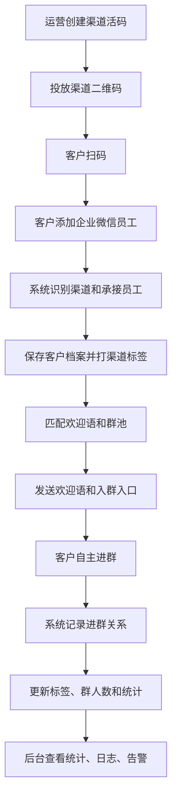

# 核心业务流程说明

## 1. 运营创建渠道活码流程

```text
运营登录后台
↓
进入渠道活码页面
↓
新建渠道活码
↓
填写渠道名称和渠道编码
↓
绑定员工池
↓
绑定渠道标签
↓
绑定欢迎语模板
↓
绑定默认群池
↓
生成渠道二维码
↓
系统保存二维码和渠道配置
↓
后台展示二维码
↓
运营复制、下载并投放到对应渠道
```

完成标准：

- 渠道活码可区分不同客户来源。
- 活码已绑定员工池、欢迎语、渠道标签和默认群池。
- 二维码可查看、复制、下载。

---

## 2. 客户扫码加好友流程

```text
客户微信扫码
↓
进入添加企业微信员工页面
↓
客户添加员工
↓
系统收到新增客户事件
↓
系统识别客户、员工、渠道来源
↓
系统创建或更新客户记录
↓
系统记录客户与员工关系
↓
系统给客户打渠道标签
↓
系统匹配欢迎语模板
↓
系统匹配群池
↓
系统记录事件日志
```

完成标准：

- 能识别客户来源渠道。
- 能记录客户实际添加的员工。
- 能生成客户档案和客户员工关系。
- 能自动打渠道标签。

---

## 3. 欢迎语与入群入口发送流程

```text
客户添加员工成功
↓
系统匹配渠道欢迎语
↓
未匹配到渠道欢迎语时使用默认欢迎语
↓
系统匹配客户应进入的群池
↓
系统选择当前可用客户群
↓
生成或选择入群入口
↓
向客户发送欢迎语和入群入口
↓
记录发送成功或失败日志
```

完成标准：

- 欢迎语支持文本、客户昵称变量、图片、链接、文件、入群入口。
- 不同渠道可使用不同欢迎语。
- 发送成功和失败均有记录。
- 系统只引导客户入群，不强制客户入群。

---

## 4. 客户进群流程

```text
客户点击或扫描欢迎语中的入群入口
↓
客户进入客户群
↓
系统收到客户群变更事件
↓
系统识别客户和客户群
↓
系统同步客户群信息
↓
系统记录客户已进群
↓
系统保存客户与群关系
↓
系统给客户打“已进群”或对应群标签
↓
系统更新渠道转化数据
↓
系统更新群池人数
↓
系统记录进群日志
```

完成标准：

- 可记录客户进入哪个群。
- 可记录客户入群时间、入群渠道、入群方式。
- 可更新渠道转化数据和群池人数。
- 可自动打群标签。

---

## 5. 客户退群流程

```text
客户退出客户群
↓
系统收到客户群变更事件
↓
系统识别退群客户和客户群
↓
系统更新客户与群关系
↓
系统记录退群时间
↓
系统更新群池人数
↓
系统更新退群统计
↓
系统记录退群日志
```

完成标准：

- 可记录客户退群时间。
- 可标记客户是否仍在群内。
- 可更新退群人数和群池人数。

---

## 6. 群满切换流程

```text
系统获取或同步客户群当前人数
↓
判断当前群是否达到人数阈值
↓
未达到阈值时继续使用当前群
↓
达到阈值时切换到下一个可用备用群
↓
存在备用群时后续客户收到备用群入口
↓
无可用备用群时触发告警
↓
如果配置自动建群，则进入后续扩展流程
```

完成标准：

- 群达到阈值后不再作为优先承接群。
- 可按排序切换备用群。
- 无可用群时产生告警。

---

## 7. 后台统计查看流程

```text
运营进入统计报表页面
↓
选择时间范围
↓
选择渠道 / 员工 / 群池筛选条件
↓
系统展示新增好友数、进群人数、退群人数、转化率等指标
↓
运营查看明细或导出数据
```

完成标准：

- 支持按时间范围筛选。
- 支持按渠道、员工、群池筛选。
- 支持 CSV / Excel 导出。
- 指标口径与统计指标清单一致。

---

## 8. 业务流程总览


